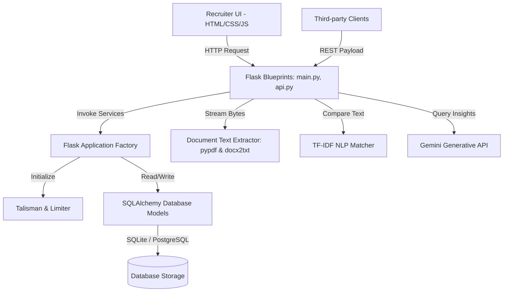

# TalentScanner - Advanced Resume & Job Matcher

TalentScanner is an enterprise-grade, production-ready Application Tracking System (ATS) optimization and resume parsing application. It enables HR and recruitment teams to assess candidate fitness against job descriptions using hybrid analytics (combining high-performance local TF-IDF bi-gram overlap calculations with optional generative Gemini AI insights).

---

## Key Features

*   **Executive Dashboard:** Centralized metrics representing total active positions, scanned resumes, and average matching scores.
*   **Pipeline Management:** Initialize individual position requirements and maintain localized, isolated lists of candidates.
*   **Hybrid Evaluation Engine:**
    *   *Local Mode:* High-speed, offline-safe TF-IDF Vectorizer with bi-gram range support and cosine similarity ranking.
    *   *AI Mode (Gemini):* Integrates with `gemini-1.5-flash` to extract semantic skills matches, find critical gaps, assess strengths, and compile concrete resume action plans.
*   **In-Memory Stream Processing:** Uploaded files are parsed directly from memory buffers (`io.BytesIO`) without writing temporary files to persistent disk, preventing file leaks and multi-user race conditions.
*   **Interactive Recruiter Interface:** Responsive dark-mode styling with CSS transitions, circular SVG fitness meters, interactive drag-and-drop file zones, and status scanner animations.
*   **Integration REST API:** Programmatic endpoints supporting both raw JSON bodies and multipart-form uploads for third-party ATS integrations.

---

## System Architecture

TalentScanner follows **Clean Architecture** guidelines to isolate business logic, presentation routing, database services, and parser gateways.



### Directory Structure

```
├── app/
│   ├── __init__.py          # Flask factory & template filters
│   ├── config.py            # Dotenv config & validations
│   ├── database.py          # SQLAlchemy binding instance
│   ├── models.py            # Database tables schema definition
│   ├── routes/
│   │   ├── main.py          # UI Page controllers
│   │   └── api.py           # REST API endpoints
│   └── services/
│       ├── parser.py        # PDF/DOCX/TXT text extractor
│       ├── matcher.py       # TF-IDF & keyword overlap math
│       └── ai_insights.py   # Gemini API integration & fallback
├── static/
│   └── style.css            # Custom dark-theme stylesheet
├── templates/
│   ├── base.html            # Core layout HTML skeleton
│   ├── dashboard.html       # Recruiter analytics home
│   ├── job_details.html     # Uploader & ranking leaderboard
│   ├── match_report.html    # Detailed applicant feedback card
│   └── history.html         # Historical evaluations table
├── tests/
│   ├── test_parser.py       # Extractor unit tests
│   ├── test_matcher.py      # NLP mathematical unit tests
│   └── test_routes.py       # Route integration tests
├── .env.example             # Environment configuration variables
├── main.py                  # CLI application entry point
├── render.yaml              # Web service deployment config
├── requirements.txt         # Production dependencies
├── wsgi.py                  # WSGI entry point
└── README.md                # System documentation
```

---

## Local Setup Guide

### 1. Prerequisites
*   Python 3.10 or 3.11
*   Virtual environment tool (`venv`)

### 2. Installation Steps
Clone this repository to your workspace, then execute:

```powershell
# Create virtual environment
python -m venv venv

# Activate virtual environment
# Windows (PowerShell):
.\venv\Scripts\Activate.ps1
# macOS/Linux:
source venv/bin/activate

# Install updated dependencies
pip install -r requirements.txt
```

### 3. Environment Configurations
Copy `.env.example` to `.env` and fill in the details:

```bash
FLASK_ENV=development
SECRET_KEY=generate-a-secure-random-string
PORT=10000

# Optional: Add to unlock advanced Gemini ATS gap-analysis reports
GEMINI_API_KEY=your_gemini_api_key_here
```

### 4. Running the Application
To run the local server under Flask:

```powershell
python main.py
```
Open `http://localhost:10000` in your web browser.

---

## Running the Test Suite

The project includes unit and integration tests covering text parsers, matching formulas, database writes, and web routers. Tests are run using `pytest`.

```powershell
# Run the test suite via python runner
.\venv\Scripts\python.exe -m pytest
```

---

## API Documentation

### POST `/api/match`
Programmatically calculates compatibility scores for multiple resumes.

#### Method 1: JSON Payload
*   **Headers:** `Content-Type: application/json`
*   **Body:**
    ```json
    {
      "job_description": "We need a Python developer with SQL experience.",
      "resumes": [
        {
          "filename": "john_cv.txt",
          "text": "Experienced Python engineer focused on writing clean Flask APIs and SQL databases."
        },
        {
          "filename": "alice_cv.txt",
          "text": "Product Manager with Figma experience."
        }
      ]
    }
    ```
*   **Response (200 OK):**
    ```json
    {
      "results": [
        {
          "filename": "john_cv.txt",
          "score": 78.43,
          "insights": {
            "matched_keywords": ["python", "experience", "sql", "developer"],
            "missing_keywords": ["need"],
            "match_count": 4,
            "missing_count": 1
          }
        },
        {
          "filename": "alice_cv.txt",
          "score": 0.0,
          "insights": {
            "matched_keywords": [],
            "missing_keywords": ["python", "developer", "experience", "sql", "need"],
            "match_count": 0,
            "missing_count": 5
          }
        }
      ]
    }
    ```

#### Method 2: Multipart Form Data
Useful for uploading binary files directly.
*   **Content-Type:** `multipart/form-data`
*   **Form Parameters:**
    *   `job_description` (text): The raw job requirements.
    *   `resumes` (file, multiple): The PDF, DOCX, or TXT resume files.

---

## Database Schema

The database uses a relational schema defined in `app/models.py`. By default, it runs on SQLite (`resume_matcher.db` in the root directory), but can be configured to target PostgreSQL by updating the `DATABASE_URL` in the environment.

### 1. `JobDescription`
*   `id` (Integer, Primary Key)
*   `title` (String, e.g. "Senior Full Stack Engineer")
*   `description_text` (Text)
*   `created_at` (DateTime, Default: UTC Now)

### 2. `CandidateResume`
*   `id` (Integer, Primary Key)
*   `filename` (String, Name of uploaded file)
*   `extracted_text` (Text)
*   `skills_extracted` (Text, Optional)
*   `created_at` (DateTime, Default: UTC Now)

### 3. `MatchResult`
*   `id` (Integer, Primary Key)
*   `job_id` (Integer, Foreign Key referencing `JobDescription.id` with CASCADE delete)
*   `resume_id` (Integer, Foreign Key referencing `CandidateResume.id` with CASCADE delete)
*   `similarity_score` (Float, compatibility percentage)
*   `ai_analysis` (Text, JSON string containing fit summary, strengths, gaps, and improvements)
*   `created_at` (DateTime, Default: UTC Now)

---

## Troubleshooting

*   **PDF/DOCX Extraction Fails:** If a document fails to parse, TalentScanner catches the exception gracefully per-file. Verify that the file is not password-protected, encrypted, or corrupted.
*   **AI Reports show "Pattern Mode":** If the dashboard reports "Keyword Pattern" or `is_ai_powered` is false, it means either your `GEMINI_API_KEY` is not loaded, has expired, or the network requests timed out. Check your `.env` configuration.
*   **Rate Limits Triggered:** The system has security rate-limiting. If you receive an HTTP 429 Too Many Requests, slow down your submissions. Limits can be modified in `app/config.py`.
